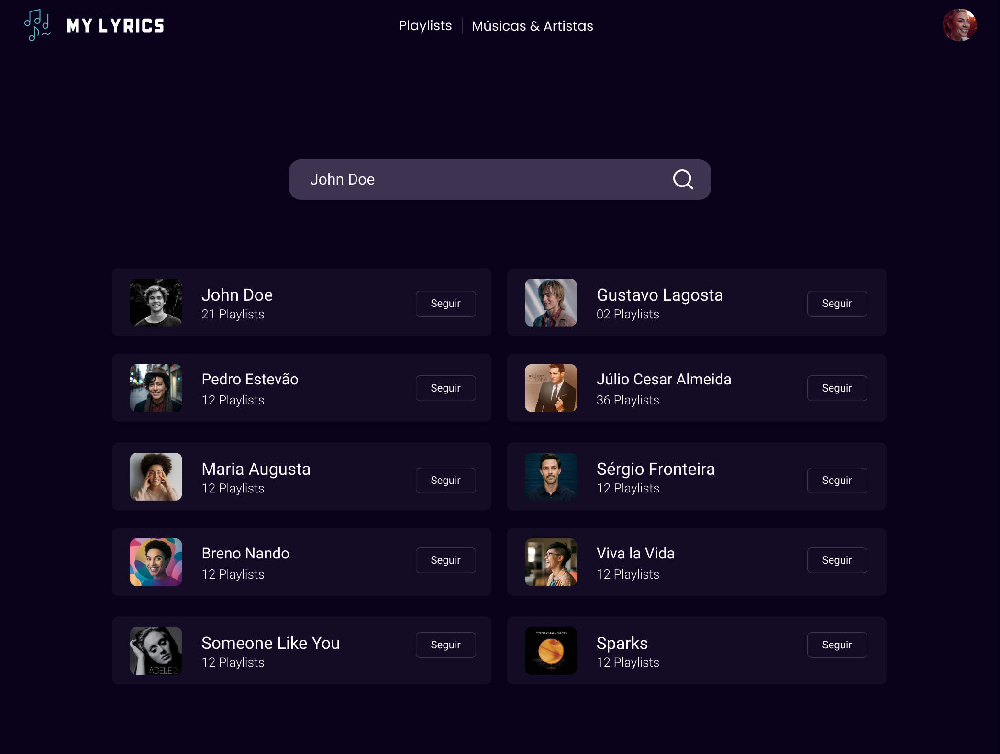

# Introdução

Este repositório faz parte da entrega da disciplina de **Arquitetura e Desenho de Software** do semestre **2024.1**.

O escopo do projeto era um aplicativo de letras de músicas como o Vagalumes ou Letras aplicando os conceitos de arquitetura de software.

A documentação do projeto (Atividades da disciplina) está disponível no [GitPages](https://unbarqdsw2024-1.github.io/2024.1_G10_My_Lyrics)

O software não possui documentação de código, apenas uma documentação de arquitetura.

# Aplicação

Venha escutar suas músicas favoritas em nossa aplicação. <br/>
Aqui, você pode encontrar as melhores músicas e ainda aprender a letra de cada uma delas.

A aplicação pode ser acessada [aqui](https://www.learnwithpadas.com/musica/07c523cc-46e8-437d-b25b-a50564f636de).



# Participantes

<div style="display: flex;">
  <div style="flex: 1">

|Matrícula | Aluno | Github |
| -- | -- | -- |
| 211031646  |  Bruno Medeiros de Oliveira | <a href="https://github.com/brunomed"> </a> |
| 211031673  |  Cauã Matheus Alves Corrêa | <a href="https://github.com/CauaMatheus"> </a> |
| 211030783  |  Gustavo Henrique Rodrigues de Sousa | <a href="https://github.com/GustavoHenriqueRS"> </a> |
| 211029343  |  Gustavo Kenzo Araki Takechi | <a href="https://github.com/gustavokenzo1"> </a> |
| 190125829  |  Ian da Costa Gama | <a href="https://github.com/ian-dcg"> </a> |
| 211030809  |  Júlio Cesar Almeida Dourado | <a href="https://github.com/julio-dourado"> </a> |
| 211031762  |  Leonardo Lago Moreno | <a href="https://github.com/lelamo2002"> </a> |
| 180145509  |  Lucas Ramon Alves de Oliveira | <a href="https://github.com/lramon2001"> </a> |
| 211041240  |  Manoel Felipe Teixeira Neto | <a href="https://github.com/Manoel835"> </a> |
| 211039617  |  Maria Luisa Alves Rodrigues | <a href="https://github.com/marialuisa214"> </a> |
| 190036940  |  Rafael Fernandes Amancio | <a href="https://github.com/Rafael-gc"> </a> |
| 211031495  |  Samuel Ricardo Dias da Silva | <a href="https://github.com/SamuelRicardoDS"> </a> |
| 211031870  |  Vinicius Eduardo Muniz da Silva | <a href="https://github.com/vinicius-muniz"> </a> |

  </div>
  <div style="flex: 1">

# Tecnologia

A aplicação foi desenvolvida utilizando a linguagem typescript, tanto para o backend quanto para o frontend.
### Frontend

Para o frontend, foi utilizado uma release candidate do React "19.0.0-rc-f994737d14-20240522".

Os participantes, cansados do mesmo de sempre, decidiram se aventurar em uma versão do react cheia de bugs e novas funcionalidades.

**Uma release candidate não é uma versão beta ou alpha; é, na verdade, uma versão que ainda está sendo alterada constantemente. É apenas uma prova de conceito ou uma ideia para que, no futuro, possa ser uma versão alpha ou beta. Com isso, muitos bugs foram enfrentados pelos participantes**

### Backend

Para o backend, foi utilizado principalmente Express e Prisma.

Para aprendizado e aplicação de conceitos da disciplina, as dependências que devem ser injetadas foram criadas por um design pattern chamado `factory` ao invés de usar a biblioteca `tsyringe`. Vários outros padrões como o `singleton`, `command`, `adapter` e `facade` também foram utilizados e podem ser encontrados na documentação da arquitetura. 

  </div>
</div>

# Docs

Para a documentação do projeto, foi utilizado a recomendação e template da professora.

O template é feito em markdown e utiliza o [docsify](https://docsify.js.org/#/) para gerar o site.

### Caso não tenha instalado o docsify, instale-o executando esse comando:
```shell
npm i docsify-cli -g
```

### Para executar a documentação localmente:

```shell
docsify serve ./docs
```

**Ou acesse pelo navegador [aqui](https://unbarqdsw2024-1.github.io/2024.1_G10_My_Lyrics)**
