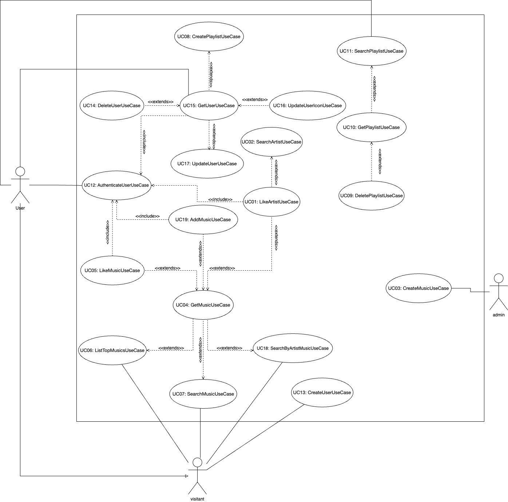
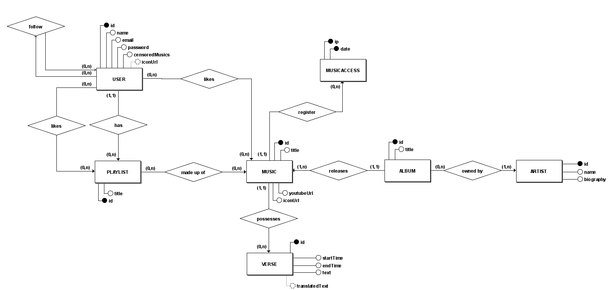
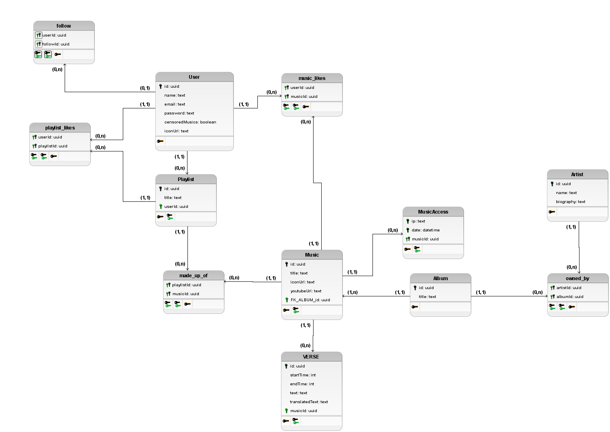

# 4.1. Módulo Estilos e Padrões Arquiteturais

## Versionamento

| Descrição                           | Autor                                                                   | Data       |
| ----------------------------------- | ----------------------------------------------------------------------- | ---------- |
| Backlog UC                          | Todos, exceto Vinicius, Rafael e Gustavo Henrique                       | 22/07/2024 |
| DE-R                                | Cauã, Bruno, Leonardo, Gustavo Kenzo, Gustavo Henrique, Manoel e Rafael | 30/07/2024 |
| DLD                                 | Cauã, Maria e Samuel                                                    | 07/08/2024 |
| Diagrama de Pacotes                 | Cauã, Gustavo Kenzo                                                     | 10/08/2024 |
| Adição do diagrama de Casos de uso  | Leonardo Lago, Gustavo Kenzo                                            | 14/08/2024 |
| revisão do diagrama de Casos de uso | Gustavo Henrique, Cauã                                                  | 14/08/2024 |

## 1. Introdução

O Documento de Arquitetura de Software (DAS) desempenha um papel crucial no desenvolvimento de sistemas, oferecendo uma descrição detalhada da estrutura do software, seus principais componentes e as interações entre eles. Funciona como um manual orientador para a equipe de desenvolvimento, assegurando que todos os membros compreendam de forma clara e uniforme a arquitetura planejada. Além disso, o DAS melhora a comunicação entre as partes interessadas, registra decisões importantes e garante que o sistema seja desenvolvido de forma consistente, atendendo tanto aos objetivos técnicos quanto aos de negócios.

### 1.1 Propósito

Este Documento de Arquitetura de Software (DAS) tem como objetivo fornecer uma visão clara e estruturada da arquitetura do sistema em desenvolvimento, servindo como referência principal na documentação do projeto. Ele detalha as decisões arquitetônicas, componentes do sistema e suas interações, garantindo uma compreensão compartilhada entre todos os envolvidos.

O documento é organizado de forma a facilitar o acesso às informações relevantes para desenvolvedores, arquitetos, gerentes de projeto e outros stakeholders. Espera-se que eles utilizem este documento para guiar o desenvolvimento, garantir a conformidade com a arquitetura definida e apoiar a tomada de decisões ao longo do ciclo de vida do projeto.

### 1.2 Escopo

Este Documento de Arquitetura de Software (DAS) abrange as principais decisões de design do sistema, incluindo a estrutura geral, os componentes principais, suas interações e as tecnologias utilizadas. Ele influencia diretamente a implementação do software, a definição de padrões de codificação, a escolha de ferramentas e frameworks, e a integração de componentes. Além disso, serve como base para decisões futuras relacionadas à manutenção, evolução do sistema, e garantia de qualidade.

### 1.3 Definições, Acrônimos e Abreviações

[Esta subseção fornece as definições de todos os termos, acrônimos e abreviações necessárias para interpretar corretamente o Documento de Arquitetura de Software. Esta informação pode ser fornecida por referência ao Glossário do projeto.]

### 1.4 Referências

[Esta subseção fornece uma lista completa de todos os documentos referenciados em outras partes do Documento de Arquitetura de Software. Identifique cada documento pelo título, número do relatório (se aplicável), data e organização de publicação. Especifique as fontes de onde as referências podem ser obtidas. Esta informação pode ser fornecida por referência a um apêndice ou a outro documento.]

### 1.5 Visão Geral

[Esta subseção descreve o que o restante do Documento de Arquitetura de Software contém e explica como o Documento de Arquitetura de Software está organizado.]

## 2. Representação Arquitetônica

[Esta seção descreve o que é a arquitetura de software para o sistema atual e como ela é representada. Das Visões de Caso de Uso, Lógica, Processo, Implementação e Implantação, ela enumera as visões que são necessárias e, para cada visão, explica quais tipos de elementos de modelo ela contém.]

## 3. Objetivos e restrições arquiteturais

[Esta seção descreve os requisitos e objetivos de software que têm um impacto significativo na arquitetura; por exemplo, segurança, privacidade, uso de um produto pronto, portabilidade, distribuição e reutilização. Também captura as restrições especiais que podem se aplicar: estratégia de design e implementação, ferramentas de desenvolvimento, estrutura da equipe, cronograma, código legado e assim por diante.]

## 4. Visão de Caso de Uso

As visões de casos de uso são representações, visuais ou textuais, que mostram como os usuários (atores) interagem com um sistema para atingir um objetivo específico. Essas visões são essenciais para capturar os requisitos funcionais, ao ilustrar as principais funcionalidades e o fluxo de interações entre os usuários e o sistema. Por meio de diagramas e descrições detalhadas, essas visões proporcionam uma compreensão mais profunda das necessidades dos usuários, facilitando a comunicação entre desenvolvedores, stakeholders e equipes de design. Além disso, servem como uma base sólida para a implementação e teste do sistema.

| Código | Descrição do Caso de Uso            |
| ------ | ----------------------------------- |
| UC01   | Cadastrar usuário                   |
| UC02   | Autenticar usuário                  |
| UC03   | Atualizar usuário                   |
| UC04   | Atualizar preferência de palavrões  |
| UC05   | Deletar Conta de usuário            |
| UC06   | Buscar Música                       |
| UC07   | Cadastrar Música                    |
| UC08   | Traduzir Música                     |
| UC09   | Favoritar Música                    |
| UC10   | Recomendar Música                   |
| UC11   | Listar as 5 melhores músicas do dia |
| UC12   | Buscar Cantores                     |
| UC13   | Ver perfil                          |
| UC14   | Favoritar Cantores                  |
| UC15   | Criar Playlist                      |
| UC16   | Buscar Playlist                     |
| UC17   | Favoritar Playlist                  |
| UC18   | Deletar Playlist                    |
| UC19   | Seguir Pessoas                      |
| UC20   | Buscar Parte da Letra               |
| UC21   | Reportar Erros                      |

<!-- [Esta seção lista casos de uso ou cenários do modelo de caso de uso se eles representarem alguma funcionalidade significativa e central do sistema final, ou se tiverem uma ampla cobertura arquitetônica — exercem muitos elementos arquitetônicos ou se destacam ou ilustram um ponto específico e delicado da arquitetura.] -->

### 4.1 Diagrama de Caso de Uso

<figure align="center">

  <figcaption>Digrama de Caso de Uso - My_Lyric</figcaption>
</figure>

O diagrama de caso de uso é uma representação visual usada para mostrar as interações entre os usuários (atores) e um sistema. Ele faz parte da UML (Unified Modeling Language) e descreve as funcionalidades que o sistema deve oferecer, representadas por "casos de uso".

Cada ator no diagrama representa um usuário ou sistema externo que interage com o sistema, enquanto os casos de uso mostram as ações ou serviços que o sistema realiza em resposta a essas interações.

O objetivo principal do diagrama de caso de uso é capturar os requisitos funcionais do sistema de forma clara e compreensível, facilitando a comunicação entre desenvolvedores, analistas e stakeholders. É uma ferramenta fundamental na análise de requisitos, ajudando a definir o que o sistema deve fazer do ponto de vista do usuário.

## 5 Visão Lógica

A visão lógica na arquitetura de software representa uma parte essencial do sistema, abrangendo Classes e Pacotes. Essa visão atua como uma abstração dos modelos criados, realçando suas características principais e simplificando suas representações. A modelagem de diagramas de classes e pacotes permite uma análise mais aprofundada das principais camadas arquiteturais definidas no projeto. Para uma perspectiva ainda mais abstrata, também é utilizado o diagrama de atividades. A seguir, são apresentados os diagramas desenvolvidos e suas inter-relações.

### 5.1 Visão Geral

[Esta subseção descreve a decomposição geral do modelo de design em termos de sua hierarquia de pacotes e camadas.]

### 5.2 Pacotes de Design arquiteturalmente significantes

[Para cada pacote significativo, inclua uma subseção com seu nome, uma breve descrição e um diagrama com todas as classes e pacotes significativos contidos dentro do pacote. Para cada classe significativa no pacote, inclua seu nome, breve descrição e, opcionalmente, uma descrição de algumas de suas principais responsabilidades, operações e atributos.]

#### 5.2.1 Diagrama de Pacotes

<figure align="center">

  <figcaption>Digrama de Pacotes - My_Lyric</figcaption>
</figure>

O diagrama de pacotes é uma representação gráfica que organiza os elementos de um sistema em agrupamentos lógicos chamados pacotes. Esse diagrama é usado para mostrar a organização hierárquica dos pacotes e as dependências entre eles, facilitando a visualização da estrutura modular do sistema e a gestão da complexidade do projeto. É uma ferramenta crucial para entender e manter a arquitetura do sistema, permitindo que as equipes de desenvolvimento identifiquem facilmente como os diferentes módulos se interconectam e colaboram.

## 6. Visão de Processo

[Esta seção descreve a decomposição do sistema em processos leves (threads únicos de controle) e processos pesados (agrupamentos de processos leves). Organize a seção por grupos de processos que se comunicam ou interagem. Descreva os principais modos de comunicação entre os processos, como passagem de mensagens, interrupções e rendezvous.]

## 7. Visão de Implantação

[Esta seção descreve uma ou mais configurações de rede física (hardware) nas quais o software é implantado e executado. É uma visão do Modelo de Implantação. No mínimo, para cada configuração, deve-se indicar os nós físicos (computadores, CPUs) que executam o software e suas interconexões (barramento, LAN, ponto a ponto, e assim por diante). Também inclua um mapeamento dos processos da Visão de Processo nos nós físicos.]

## 8. Visão de Implementação

[Esta seção descreve a estrutura geral do modelo de implementação, a decomposição do software em camadas e subsistemas no modelo de implementação e quaisquer componentes arquitetonicamente significativos.]

### 8.1 Visão Geral

[Esta subseção nomeia e define as várias camadas e seus conteúdos, as regras que regem a inclusão em uma determinada camada e os limites entre as camadas. Inclua um diagrama de componentes que mostre as relações entre as camadas.]

### 8.2 Camadas

[Para cada camada, inclua uma subseção com seu nome, uma enumeração dos subsistemas localizados na camada e um diagrama de componentes.]

## 9. Visão de Dados

<!-- [Uma descrição da perspectiva de armazenamento de dados persistentes do sistema. Esta seção é opcional se houver poucos ou nenhum dado persistente, ou se a tradução entre o Modelo de Design e o Modelo de Dados for trivial.] -->

### DE-R

### DLD

## 10. Tamanho e Desempenho

[Uma descrição das principais características dimensionais do software que impactam a arquitetura, bem como as restrições de desempenho alvo.]

## 11. Qualidade

[Uma descrição de como a arquitetura de software contribui para todas as capacidades (além da funcionalidade) do sistema: extensibilidade, confiabilidade, portabilidade, e assim por diante. Se essas características tiverem um significado especial, como implicações de segurança, privacidade ou segurança, elas devem ser claramente delineadas.]

## Foco_01: Arquitetura de Software

Entrega Mínina: Especificação de 2 Visões do DAS (ESCOPO: necessariamente a Lógica, e mais uma (Processo; Implementação; Implantação ou Dados)).

OBS: A Visão de Caso de Uso, por ser uma visão já conhecida por vocês em outras disciplinas, não faz parte do escopo. Mas, pode ser explorada caso queiram.

Apresentação (em sala) explicando o Documento de Arquitetura (DAS), com: (i) rastro claro aos membros participantes (MOSTRAR QUADRO DE PARTICIPAÇÕES & COMMITS); (ii) justificativas & senso crítico sobre esse artefato, em especial detalhando particularidades sobre estilos e padrões arquiteturais idealizados para a aplicação; (iii) breve apresentação das visões do DAS no escopo da aplicação, e (iv) comentários gerais sobre o trabalho em equipe. Tempo da Apresentação: +/- 8min. Recomendação: Apresentar diretamente via Wiki ou GitPages do Projeto. Baixar os conteúdos com antecedência, evitando problemas de internet no momento de exposição nas Dinâmicas de Avaliação.

A Wiki ou GitPages do Projeto deve conter um tópico dedicado ao Módulo Estilos e Padrões Arquiteturais, com Especificação das Visões do DAS, histórico de versões, referências, e demais detalhamentos gerados pela equipe nesse escopo.

Demais orientações disponíveis nas Diretrizes (vide Moodle).
