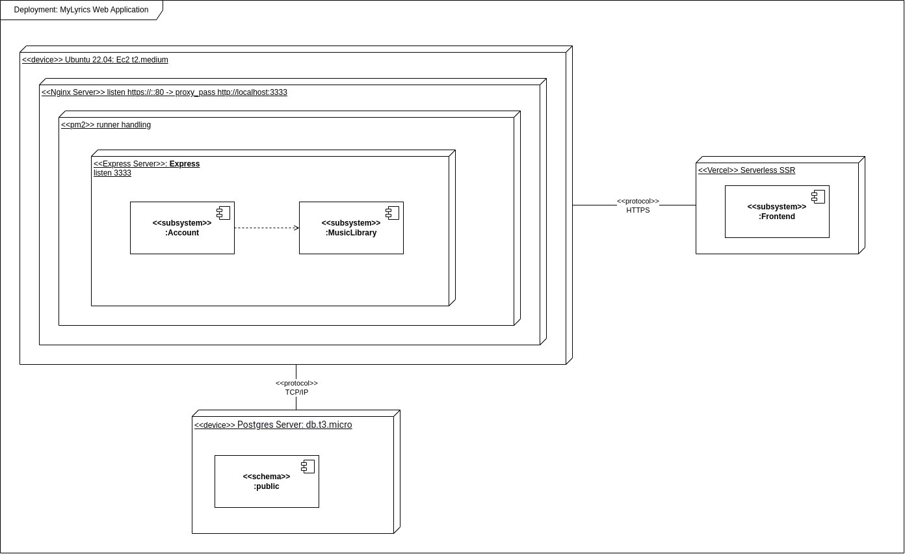

# 4.1. Módulo Estilos e Padrões Arquiteturais

## Versionamento

| Descrição                           | Autor                                                                   | Data       |
| ----------------------------------- | ----------------------------------------------------------------------- | ---------- |
| Backlog UC                          | Todos, exceto Vinicius, Rafael e Gustavo Henrique                       | 22/07/2024 |
| DE-R                                | Cauã, Bruno, Leonardo, Gustavo Kenzo, Gustavo Henrique, Manoel e Rafael | 30/07/2024 |
| DLD                                 | Cauã, Maria e Samuel                                                    | 07/08/2024 |
| Diagrama de Pacotes                 | Cauã, Gustavo Kenzo                                                     | 10/08/2024 |
| Adição do diagrama de Casos de uso  | Leonardo Lago, Gustavo Kenzo                                            | 14/08/2024 |
| revisão do diagrama de Casos de uso | Gustavo Henrique, Cauã                                                  | 14/08/2024 |
| Finalizando o DAS                   | Todos menos o Vinicius e o Samuel                                       | 14/08/2024 |

## 1. Introdução

O Documento de Arquitetura de Software (DAS) desempenha um papel crucial no desenvolvimento de sistemas, oferecendo uma descrição detalhada da estrutura do software, seus principais componentes e as interações entre eles. Funciona como um manual orientador para a equipe de desenvolvimento, assegurando que todos os membros compreendam de forma clara e uniforme a arquitetura planejada. Além disso, o DAS melhora a comunicação entre as partes interessadas, registra decisões importantes e garante que o sistema seja desenvolvido de forma consistente, atendendo tanto aos objetivos técnicos quanto aos de negócios.

### 1.1 Propósito

Este Documento de Arquitetura de Software (DAS) tem como objetivo fornecer uma visão clara e estruturada da arquitetura do sistema em desenvolvimento, servindo como referência principal na documentação do projeto. Ele detalha as decisões arquitetônicas, componentes do sistema e suas interações, garantindo uma compreensão compartilhada entre todos os envolvidos.

O documento é organizado de forma a facilitar o acesso às informações relevantes para desenvolvedores, arquitetos, gerentes de projeto e outros stakeholders. Espera-se que eles utilizem este documento para guiar o desenvolvimento, garantir a conformidade com a arquitetura definida e apoiar a tomada de decisões ao longo do ciclo de vida do projeto.

### 1.2 Escopo

Este Documento de Arquitetura de Software (DAS) abrange as principais decisões de design do sistema, incluindo a estrutura geral, os componentes principais, suas interações e as tecnologias utilizadas. Ele influencia diretamente a implementação do software, a definição de padrões de codificação, a escolha de ferramentas e frameworks, e a integração de componentes. Além disso, serve como base para decisões futuras relacionadas à manutenção, evolução do sistema, e garantia de qualidade.

### 1.3 Definições, Acrônimos e Abreviações

- **API (Application Programming Interface):** Conjunto de rotinas e padrões de programação para acesso a um aplicativo de software ou plataforma baseado na web.

- **DAS (Documento de Arquitetura de Software):** Documento que detalha a arquitetura do software, incluindo estrutura, componentes principais e interações.

- **DE-R (Diagrama de Entidade-Relacionamento):** Diagrama que modela as entidades do sistema e seus relacionamentos.

- **DLD (Diagrama Lógico de Dados):** Diagrama que representa a estrutura lógica dos dados do sistema.

- **UML (Unified Modeling Language):** Linguagem de modelagem padrão usada para especificar, visualizar, construir e documentar os artefatos de um sistema de software.

- **UC (Use Case - Caso de Uso):** Descrição de uma sequência de ações, incluindo variantes, que um sistema executa para fornecer um resultado observável de valor para um ator.

- **MyLyrics:** Nome do sistema em desenvolvimento que é o foco deste Documento de Arquitetura de Software.

- **Backlog UC:** Lista de casos de uso que precisam ser implementados no sistema.

### 1.4 Referências

- **UFPE.** Documento de Arquitetura de Software da UFPE. Disponível em [UFPE RUP Software Architecture Document](https://www.cin.ufpe.br/~gta/rup-vc/core.base_rup/workproducts/rup_software_architecture_document_C367485C.html?nodeId=8d5440e6).
- **MyLyrics Project Wiki.** Documentação interna do projeto MyLyrics disponível na [Wiki do projeto no GitHub](https://github.com/UnBArqDsw2024-1/2024.1_G10_My_Lyrics).
- **Sommerville, I. (2011).** Software Engineering (9th Edition). Addison-Wesley.
- **Gamma, E., Helm, R., Johnson, R., & Vlissides, J. (1994).** Design Patterns: Elements of Reusable Object-Oriented Software. Addison-Wesley.


### 1.5 Visão Geral

Este Documento de Arquitetura de Software (DAS) está organizado para fornecer uma visão compreensiva da arquitetura do sistema em desenvolvimento. O documento é estruturado da seguinte forma:

1. **Introdução:** Esta seção fornece uma visão geral do propósito, escopo, definições, acrônimos, abreviações e referências do DAS. Ela estabelece a base para a compreensão do documento e define o contexto em que a arquitetura do sistema está inserida.

2. **Representação Arquitetural:** Descreve as diferentes representações arquiteturais do sistema, como as visões de Caso de Uso, Lógica, Processo, Implementação e Implantação. Cada visão é detalhada com diagramas e descrições que ilustram a estrutura e os componentes do sistema.

3. **Objetivos e Restrições Arquiteturais:** Identifica os requisitos e objetivos arquiteturais que impactam o design do sistema, incluindo segurança, portabilidade, e outras restrições específicas que devem ser consideradas durante o desenvolvimento.

4. **Visão de Caso de Uso:** Apresenta os casos de uso do sistema, detalhando como os usuários interagem com o sistema para alcançar seus objetivos. Inclui diagramas e descrições dos casos de uso e seus fluxos de interação.

5. **Visão Lógica:** Fornece uma visão detalhada dos principais componentes e pacotes do sistema. Inclui diagramas de pacotes e classes que ilustram a estrutura e as relações entre os principais elementos do sistema.

6. **Visão de Processo:** Descreve a decomposição do sistema em processos leves e pesados, incluindo a comunicação entre processos e os principais modos de interação, como passagem de mensagens e interrupções.

7. **Visão de Implantação:** Detalha a alocação dos componentes do sistema sobre o hardware e a infraestrutura de rede. Inclui diagramas que mostram a configuração dos ambientes de execução e os recursos necessários.

8. **Visão de Implementação:** Apresenta a estrutura do modelo de implementação, incluindo as camadas e subsistemas. Fornece um diagrama de componentes e descreve a organização das camadas e suas responsabilidades.

9. **Visão de Dados:** (Detalhes a serem adicionados) Descreve o modelo de dados e como os dados são estruturados e manipulados dentro do sistema.

10. **Tamanho e Desempenho:** Discute as características dimensionais e restrições de desempenho do software que impactam a arquitetura.

11. **Qualidade:** Avalia como a arquitetura contribui para as qualidades não funcionais do sistema, como extensibilidade, confiabilidade e portabilidade. Também aborda aspectos de segurança e privacidade, se aplicável.

Cada seção deste documento é projetada para fornecer uma compreensão detalhada dos diferentes aspectos da arquitetura do sistema, garantindo que todos os envolvidos no desenvolvimento estejam alinhados com as decisões arquitetônicas e possam contribuir de maneira eficaz para o sucesso do projeto.


## 2. Representação Arquitetural

[Esta seção descreve o que é a arquitetura de software para o sistema atual e como ela é representada. Das Visões de Caso de Uso, Lógica, Processo, Implementação e Implantação, ela enumera as visões que são necessárias e, para cada visão, explica quais tipos de elementos de modelo ela contém.]

## 3. Objetivos e restrições arquiteturais

[Esta seção descreve os requisitos e objetivos de software que têm um impacto significativo na arquitetura; por exemplo, segurança, privacidade, uso de um produto pronto, portabilidade, distribuição e reutilização. Também captura as restrições especiais que podem se aplicar: estratégia de design e implementação, ferramentas de desenvolvimento, estrutura da equipe, cronograma, código legado e assim por diante.]

## 4. Visão de Caso de Uso

As visões de casos de uso são representações, visuais ou textuais, que mostram como os usuários (atores) interagem com um sistema para atingir um objetivo específico. Essas visões são essenciais para capturar os requisitos funcionais, ao ilustrar as principais funcionalidades e o fluxo de interações entre os usuários e o sistema. Por meio de diagramas e descrições detalhadas, essas visões proporcionam uma compreensão mais profunda das necessidades dos usuários, facilitando a comunicação entre desenvolvedores, stakeholders e equipes de design. Além disso, servem como uma base sólida para a implementação e teste do sistema.


| Código | Descrição do Caso de Uso            | Feito |
| ------ | ----------------------------------- | ----- |
| UC01   | Cadastrar usuário                   | [x]   |
| UC02   | Autenticar usuário                  | [x]   |
| UC03   | Atualizar usuário                   | [x]   |
| UC04   | Atualizar preferência de palavrões  | [x]   |
| UC05   | Deletar Conta de usuário            | [x]   |
| UC06   | Buscar Música                       | [x]   |
| UC07   | Cadastrar Música                    | [x]   |
| UC08   | Traduzir Música                     | [x]   |
| UC09   | Favoritar Música                    | [x]   |
| UC10   | Recomendar Música                   | [x]   |
| UC11   | Listar as 5 melhores músicas do dia | [x]   |
| UC12   | Buscar Cantores                     | [x]   |
| UC13   | Ver perfil                          | [x]   |
| UC14   | Favoritar Cantores                  | [x]   |
| UC15   | Criar Playlist                      | [x]   |
| UC16   | Buscar Playlist                     | [x]   |
| UC17   | Favoritar Playlist                  | [x]   |
| UC18   | Deletar Playlist                    | [x]   |
| UC19   | Seguir Pessoas                      | [x]   |
| UC20   | Buscar Parte da Letra               | [ ]   |
| UC21   | Reportar Erros                      | [ ]   |

<!-- [Esta seção lista casos de uso ou cenários do modelo de caso de uso se eles representarem alguma funcionalidade significativa e central do sistema final, ou se tiverem uma ampla cobertura arquitetônica — exercem muitos elementos arquitetônicos ou se destacam ou ilustram um ponto específico e delicado da arquitetura.] -->

### 4.1 Diagrama de Caso de Uso

<figure align="center">


  <figcaption>Diagrama de Caso de Uso - My_Lyric</figcaption>
</figure>

O diagrama de caso de uso é uma representação visual usada para mostrar as interações entre os usuários (atores) e um sistema. Ele faz parte da UML (Unified Modeling Language) e descreve as funcionalidades que o sistema deve oferecer, representadas por "casos de uso".

Cada ator no diagrama representa um usuário ou sistema externo que interage com o sistema, enquanto os casos de uso mostram as ações ou serviços que o sistema realiza em resposta a essas interações.

O objetivo principal do diagrama de caso de uso é capturar os requisitos funcionais do sistema de forma clara e compreensível, facilitando a comunicação entre desenvolvedores, analistas e stakeholders. É uma ferramenta fundamental na análise de requisitos, ajudando a definir o que o sistema deve fazer do ponto de vista do usuário.

## 5 Visão Lógica

A visão lógica na arquitetura de software representa uma parte essencial do sistema, abrangendo Classes e Pacotes. Essa visão atua como uma abstração dos modelos criados, realçando suas características principais e simplificando suas representações. A modelagem de diagramas de classes e pacotes permite uma análise mais aprofundada das principais camadas arquiteturais definidas no projeto. Para uma perspectiva ainda mais abstrata, também é utilizado o diagrama de atividades. A seguir, são apresentados os diagramas desenvolvidos e suas inter-relações.

### 5.1 Visão Geral

### 5.2 Pacotes de Design arquiteturalmente significantes

[Para cada pacote significativo, inclua uma subseção com seu nome, uma breve descrição e um diagrama com todas as classes e pacotes significativos contidos dentro do pacote. Para cada classe significativa no pacote, inclua seu nome, breve descrição e, opcionalmente, uma descrição de algumas de suas principais responsabilidades, operações e atributos.]

#### 5.2.1 Diagrama de Pacotes

O diagrama de pacotes é uma representação gráfica que organiza os elementos de um sistema em agrupamentos lógicos chamados pacotes. Esse diagrama é usado para mostrar a organização hierárquica dos pacotes e as dependências entre eles, facilitando a visualização da estrutura modular do sistema e a gestão da complexidade do projeto. É uma ferramenta crucial para entender e manter a arquitetura do sistema, permitindo que as equipes de desenvolvimento identifiquem facilmente como os diferentes módulos se interconectam e colaboram.

<figure align="center">


  <figcaption>Diagrama de Pacotes - My_Lyric</figcaption>
</figure>


### 5.2.2 Diagrama de Classes

O diagrama de classes é uma ferramenta essencial na modelagem de sistemas orientados a objetos. Ele mostra a estrutura do sistema, detalhando as classes, seus atributos, métodos e os relacionamentos entre elas, como herança e associações. Cada classe é representada por um retângulo dividido em seções para nome, atributos e métodos, enquanto as conexões entre as classes indicam como elas interagem. Esse diagrama oferece uma visão clara e organizada do design do sistema, servindo como uma referência fundamental para desenvolvedores e arquitetos ao longo do projeto.


Como o framework acaba criando todas as estruturas do sistema, é importante demonstrar como seria
implementado em código:

```prisma
// This is your Prisma schema file,
// learn more about it in the docs: https://pris.ly/d/prisma-schema

generator client {
  provider = "prisma-client-js"
}

datasource db {
  provider = "postgresql"
  url      = env("DATABASE_URL")
}

model User {
  id             String  @id @default(uuid()) @db.Uuid
  name           String
  email          String
  password       String
  censoredMusics Boolean @default(false)
  iconUrl        String?

  following      User[]     @relation("UserFollowing")
  followers      User[]     @relation("UserFollowing")
  playlists      Playlist[]
  likedArtists   Artist[]   @relation("UsersLikedArtists")
  likedPlaylists Playlist[] @relation("UsersLikedPlaylists")
  likedMusics    Music[]    @relation("UsersLikedMusics")
  userId         String?    @db.Uuid
}

model Playlist {
  id     String @id @default(uuid()) @db.Uuid
  userId String @db.Uuid
  title  String

  onwer  User    @relation(fields: [userId], references: [id], onDelete: Cascade)
  musics Music[] @relation("PlaylistMusics")
  likes  User[]  @relation("UsersLikedPlaylists")
}

model Artist {
  id         String @id @default(uuid()) @db.Uuid
  name       String @unique
  biography  String
  profileUrl String

  albums Album[] @relation("AlbumArtists")
  likes  User[]  @relation("UsersLikedArtists")
}

model Album {
  id       String  @id @default(uuid()) @db.Uuid
  title    String
  coverUrl String?

  artists Artist[] @relation("AlbumArtists")
  musics  Music[]
}

model Music {
  id         String @id @default(uuid()) @db.Uuid
  albumId    String @db.Uuid
  title      String
  youtubeUrl String
  iconUrl    String

  album       Album         @relation(fields: [albumId], references: [id])
  verses      Verse[]
  playlists   Playlist[]    @relation("PlaylistMusics")
  likes       User[]        @relation("UsersLikedMusics")
  MusicAccess MusicAccess[]
}

model Verse {
  id             String  @id @default(uuid()) @db.Uuid
  startTime      Int
  endTime        Int
  text           String
  translatedText String?

  music   Music  @relation(fields: [musicId], references: [id])
  musicId String @db.Uuid
}

model MusicAccess {
  ip      String
  musicId String   @db.Uuid
  date    DateTime

  music Music @relation(fields: [musicId], references: [id])

  @@id([ip, date, musicId])
}

```

### 5.2.3 Diagramas de Patterns

Em nosso código, todos os UseCases devem seguir o padrão Command, onde será uma classe especializada a resolver um problema específico. Seguindo o SOLID.


#### Repositories específicos para integrar com o banco de dados:


## 6. Visão de Implantação

A visão de implantação na arquitetura de software foca na alocação dos componentes do sistema sobre o hardware e a infraestrutura de rede. Ela detalha a configuração dos ambientes de execução, incluindo servidores, equipamentos de rede e outros recursos necessários para o funcionamento adequado do software. Essa visão é essencial para garantir que o sistema opere corretamente no ambiente real, cumprindo os requisitos de desempenho, escalabilidade, segurança e disponibilidade.



## 7. Visão de Implementação

A visão de implementação em arquitetura de software descreve como o sistema será codificado, organizado e integrado. Ela abrange detalhes sobre a estrutura do código-fonte, a divisão dos módulos, a escolha de linguagens de programação e frameworks, além das diretrizes para o desenvolvimento e integração contínua. Essa visão serve como um guia para os desenvolvedores, garantindo que todos os componentes sejam construídos de forma coesa e que o sistema como um todo seja eficiente, mantenível e alinhado com os requisitos funcionais e não funcionais estabelecidos.


### 7.1 Visão Geral

### 7.2 Camadas

Aplicamos a arquitetura limpa, que organiza o software em quatro camadas:

Entidades: Regras de negócio fundamentais, independentes de tecnologia.
Casos de Uso: Lógica de aplicação, coordenando as entidades sem depender de detalhes externos.
Interface de Adaptação: Adaptadores que conectam casos de uso ao mundo externo.
Frameworks e Drivers: Detalhes técnicos, como bancos de dados e frameworks, que dependem das camadas internas.
Essa estrutura modular facilita a manutenção, testes e evolução do sistema, garantindo robustez e flexibilidade.


## 8. Visão de Dados
A visão de dados em arquitetura de software descreve como os dados são organizados, armazenados e manipulados dentro do sistema. Esta seção abrange a estrutura dos bancos de dados, esquemas de tabelas, modelos de dados e a maneira como as informações são gerenciadas ao longo do ciclo de vida do software. Além disso, detalha as relações entre os diferentes conjuntos de dados, as regras de integridade e as políticas de acesso e segurança aplicadas. A visão de dados é fundamental para garantir que as informações sejam acessíveis, consistentes e protegidas, atendendo aos requisitos de desempenho, escalabilidade e confiabilidade do sistema.

### DE-R


### DLD


## 9. Tamanho e Desempenho

| **Característica Dimensional**         | **Descrição**                                                                                        | **Restrições de Desempenho Alvo** |
| -------------------------------------- | ---------------------------------------------------------------------------------------------------- | --------------------------------- |
| **Manutenibilidade e Extensibilidade** | Arquitetura modular e fácil de manter, com suporte para testes automatizados.                        | N/A                               |
| **Escalabilidade Vertical**            | Capacidade de aumentar a capacidade de processamento e armazenamento em servidores individuais.      | N/A                               |
| **Tolerância a Falhas**                | Implementação de estratégias para garantir que falhas em componentes não afetem a disponibilidade.   | N/A                               |
| **Mecanismos de Failover**             | Garantia de continuidade do serviço em caso de falha em componentes individuais.                     | N/A                               |
| **Recuperação de Desastres**           | Processos para recuperação rápida em caso de falhas críticas. (seeds e backups automáticos)                                       | N/A                               |


## 10. Qualidade

A arquitetura de software suporta várias capacidades além da funcionalidade básica, como extensibilidade, confiabilidade e portabilidade. Extensibilidade permite que o sistema seja adaptado com novos recursos sem comprometer sua estrutura. Confiabilidade assegura operação consistente e disponibilidade mesmo sob condições adversas. Portabilidade facilita a migração do sistema entre diferentes ambientes e plataformas.

Quando essas capacidades têm implicações específicas, como segurança e privacidade, elas devem ser claramente definidas. A arquitetura pode incluir medidas de segurança, como autenticação e controle de acesso, e garantir a privacidade dos dados dos usuários. Além disso, pode incorporar estratégias de resiliência, como redundâncias e recuperação de falhas, para manter o funcionamento do sistema em situações críticas.

Essas características garantem que o sistema não só atenda às suas funcionalidades principais, mas também seja robusto, seguro e adaptável.

