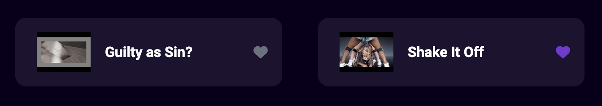
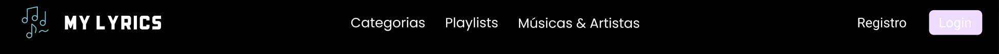

# 4.2. Módulo Reutilização de Software

## 4.2.1 Backend:

### 4.2.1.1 Continuous Deployment (CD)

[Explicação de o que é um CD e como ele pode ser utilizado em outras aplicações]
[Exemplo em código do CD da aplicação]

### 4.2.1.2 Error Handling

[Explicação da importância das padronizações de erros na api rest e como ele pode
ser utilizado em outras aplicações]
[Exemplo dos erros padronizados da aplicação]

### 4.2.1.3 Env Config

[Explicar a importância de ter e de parsear as configurações de ambientes e como
ele pode ser utilizado em outras aplicações]
[Exemplo do parser do nosso código]

### 4.2.1.4 Patterns

[Explicar a importância de ter padrões de projeto e como ele pode ser utilizado
em outras aplicações]
[Exemplo de padrões de projeto da aplicação]

## 4.2.2 Frontend:

### 4.2.2.1 Button

Criar botões como componentes reutilizáveis é crucial porque garante consistência visual e funcional na aplicação, facilita a manutenção e economiza tempo de desenvolvimento. Assim, mudanças são feitas em um único lugar e aplicadas automaticamente em toda a aplicação, além de possibilitar facilmente a replicação para serem usados em outros projetos, tornando o próximo desenvolvimento mais ágil e eficiente.

#### Exemplo de Botões da aplicação

Um exemplo de reutilização de botão é o coração presente nos MusicCards e Playlists. Ele é utilizado para desmonstrar que o usuário gostou de uma música, similar a outros aplicativos de rede social, sendo necessário em multiplas partes da aplicação; outro exemplo também é o próprio MusicCard, utilizado nas páginas de artista, "músicas e artistas" e na página inicial, se demonstrando igualmente um exemplo de componente.

<figure align="center">



</figure>

```
{like !== undefined && (
            <FontAwesomeIcon
              icon={faHeart}
              className={`
                 ${like ? "text-[#7338d3]" : "text-gray-500"}
              `}
            />
          )}
```

### 4.2.2.1 Header

O componente Header é responsável por mostrar o menu de navegação da aplicação. Ele é composto pela logo da aplicação que redireciona o usuário para a página inicial da aplicação, e pelos botões de Categorias, Playlists e Músicas & Artistas. É fundamental que o Header seja "componentizado", pois ele está presente em grande parte da aplicação, e isso faz com que ele seja facilmente reutilizável.

O primeiro tipo de Header serve para quando o usuário está logado na aplicação. E, na direita do Header, é mostrado a foto de perfil do usuário, que irá redirecionar o usuário para a página de perfil do usuário.

<figure align="center">


  <figcaption>Header Logado</figcaption>
</figure>

O segundo tipo de Header serve para quando o usuário não está logado na aplicação. E, na direita do Header, é mostrado o botão de Login e Registrar, que irá redirecionar o usuário para a página de login e registro respectivamente.

<figure align="center">



  <figcaption>Header Deslogado</figcaption>
</figure>

### 4.2.2.1 MusicCard

[Explicar a importância de ter MusicCard como componente e como ele pode ser
utilizado em outras aplicações]
[Exemplo de MusicCard da aplicação]

# Histórico de versão

| Descrição                       | Autor | Data       |
| ------------------------------- | ----- | ---------- |
| Adicionando histórico de versão | Cauã  | 22/07/2024 |
