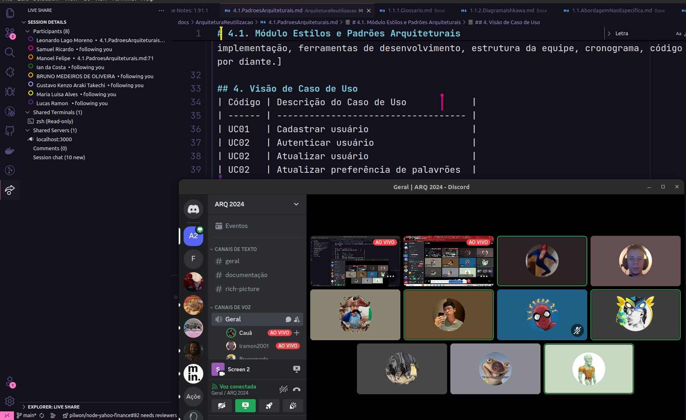

# Reuniões

## Reunião do dia 28/07/2024
Nessa reunião, além de organizarmos os cards do GH Project, foi gerado ambos backlogs de produto e de documentação.
Esses backlogs podem ser vistos nos quadros:
- [Software Kanban](https://github.com/orgs/UnBArqDsw2024-1/projects/12/views/1)
- [Docs Kanban](https://github.com/orgs/UnBArqDsw2024-1/projects/9)
Ou no documento [Padrões Arquiteturais](/ArquiteturaReutilizacao/4.1.PadroesArquiteturais?id=_4-visão-de-caso-de-uso)

