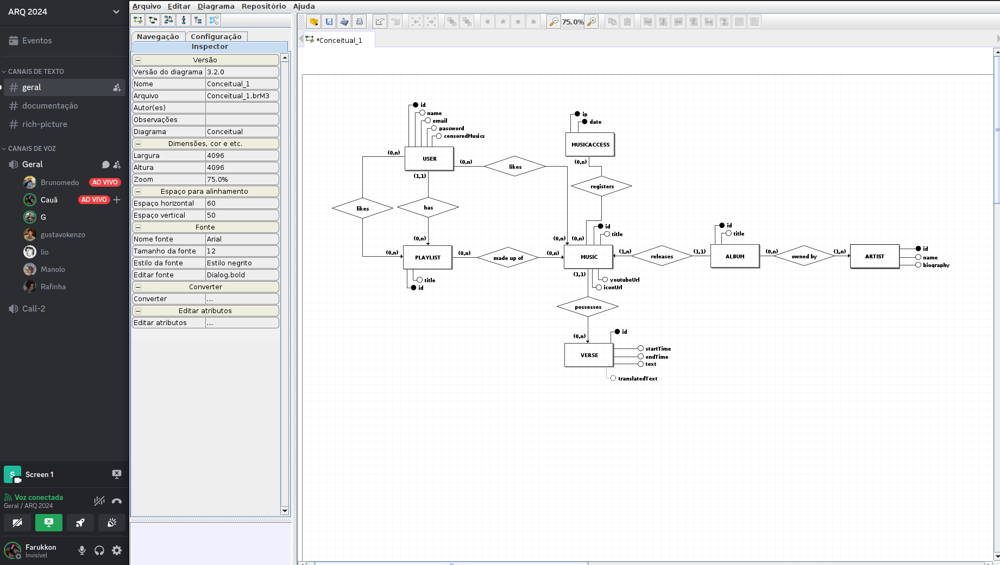
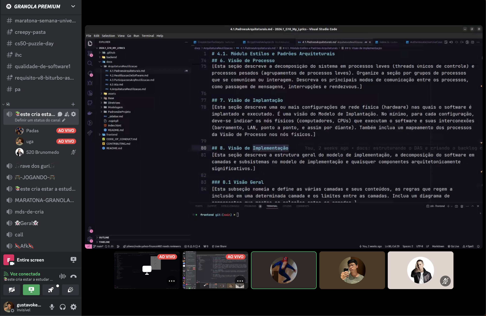
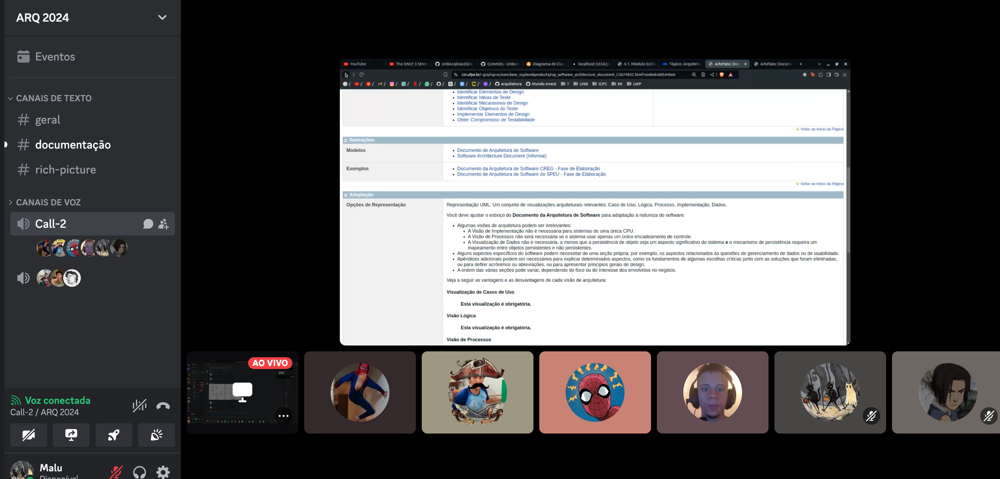

# Reuniões

## Reunião do dia 28/07/2024

Nessa reunião, além de organizarmos os cards do GH Project, foi gerado ambos backlogs de produto e de documentação.
Esses backlogs podem ser vistos nos quadros:

- [Software Kanban](https://github.com/orgs/UnBArqDsw2024-1/projects/12/views/1)
- [Docs Kanban](https://github.com/orgs/UnBArqDsw2024-1/projects/9)
  Ou no documento [Padrões Arquiteturais](/ArquiteturaReutilizacao/4.1.PadroesArquiteturais?id=_4-visão-de-caso-de-uso)
  

## Reunião do dia 29/07/2024

Nessa reunião, foi explicado a arquitetura inicial do backend para que possamos avançar na implementação do software. Foi realizado um nivelamento entre os membros para que todos entendam o que é o backend e como contribuir.

<iframe width="560" height="315" src="https://www.youtube.com/embed/7e5Mk16APgU?si=Dhk24WAiWzgOuVSs" title="YouTube video player" frameborder="0" allow="accelerometer; autoplay; clipboard-write; encrypted-media; gyroscope; picture-in-picture; web-share" referrerpolicy="strict-origin-when-cross-origin" allowfullscreen></iframe>

## Reunião do dia 30/07/2024

Nessa reunião foi elaborado o DE-R da aplicação para que possamos avançar na implementação
do software.

## Reunião do dia 10/08/2024

Nessa reunião, foi feita a refatoração do diagrama de pacotes para que fique de acordo com a realidade do projeto.

## Reunião do dia 14/08/2024
Reunião Final de entrega do projeto. Desde a finalização do desenvolvimento do Software até o refinamento do docs.

