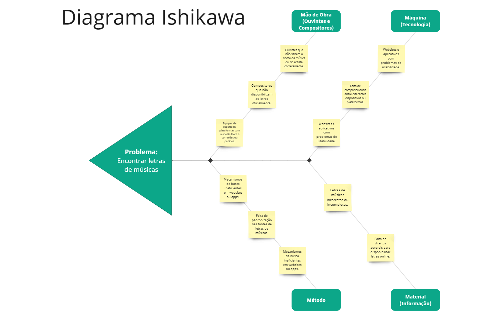
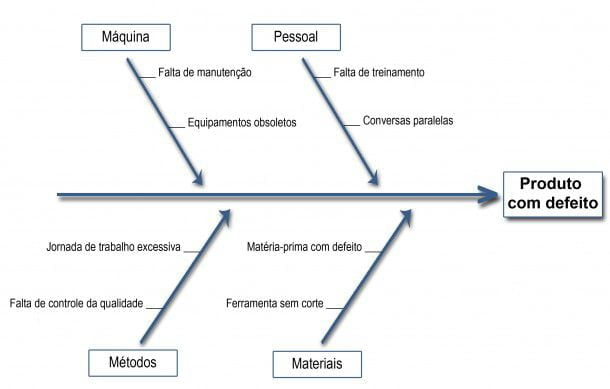
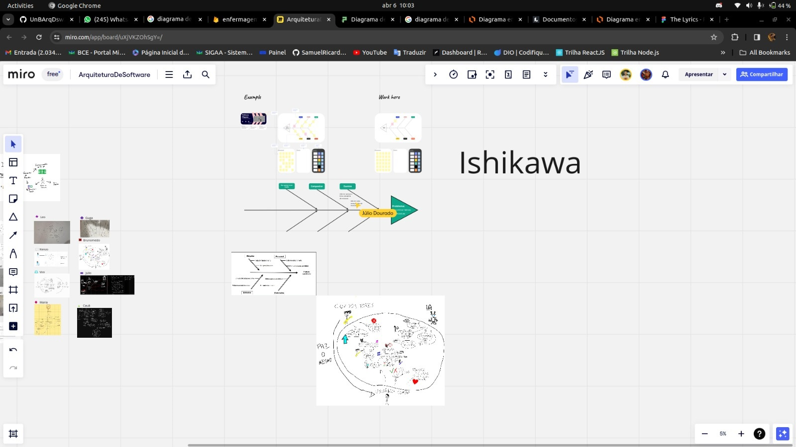

## Diagrama de Ishikawa
Um Diagrama de Ishikawa, também conhecido como diagrama de espinha de peixe ou diagrama de causa e efeito, é uma ferramenta de análise utilizada para identificar e visualizar as possíveis causas de um problema específico.

Afim de entendermos melhor os desafios enfrentados na aplicação de tradução de letras musicais, criamos o nosso Diagrama. Reconhecemos que a tradução de letras musicais apresenta desafios únicos devido à sua natureza multifacetada, que combina elementos linguísticos, culturais e artísticos. Portanto, desenvolvemos este diagrama para fornecer uma visão abrangente das possíveis causas de problemas que podem surgir ao utilizar nossa aplicação.

Nosso Diagrama de Ishikawa aborda categorias-chave, incluindo tecnologia, linguagem, precisão da tradução, contexto cultural, preferências do usuário e qualidade da interface do usuário. Ao explorarmos cada uma dessas áreas, buscamos identificar os fatores que podem afetar negativamente a experiência do usuário e a eficácia da tradução.

<!-- tabs:start -->

#### **Diagrama Ishikawa - My_Lyrics**

<figure align="center">

  
  <figcaption>DiagramaIshkawa - My_Lyric</figcaption>
</figure>

#### **Diagrama de Ishikawa - Conceito**

<figure align="center">

  
  <figcaption>DiagramaIshkawa - Conceito</figcaption>
</figure>

#### **Processo**

<figure align="center">

  
  <figcaption>DiagramaIshkawa - Processo Equipe</figcaption>
</figure>

<!-- tabs:end -->

# Histórico de versão

| Descrição | Autor | Data |
|----|----|----|
| Diagrama de Ishikawa | Gustavo, Leonardo e Maria | 07/04/2024 |
| Ajuste na imagem | Cauã | 07/04/2024 |
| Histórico de versão | Cauã | 22/07/2024 |
