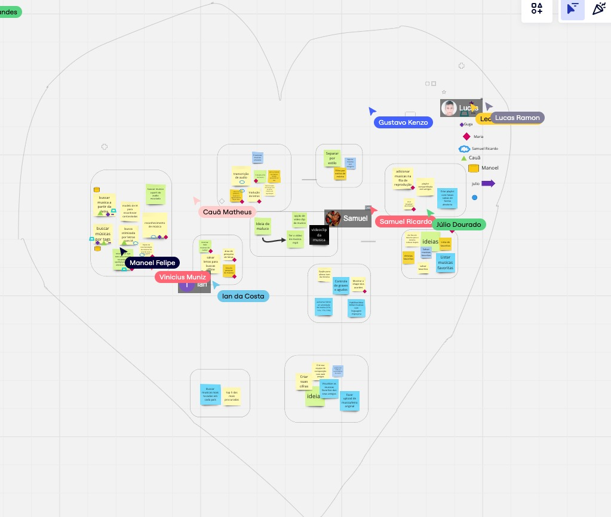
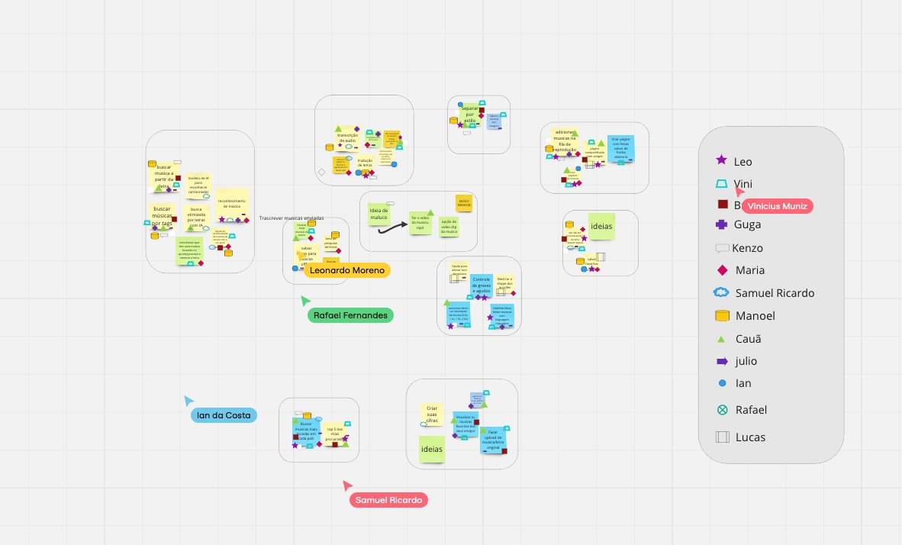
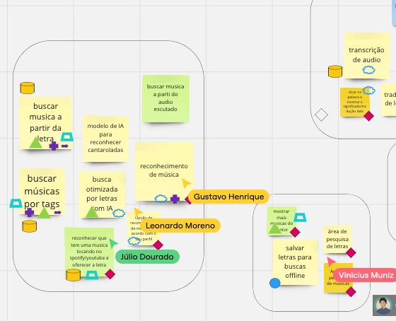
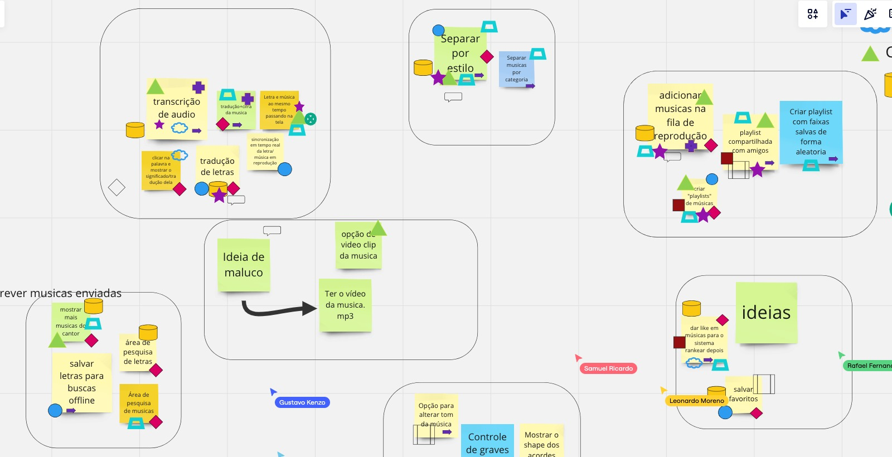

# 1.1. Módulo Projeto Não Orientado a Abordagens Específicas

## Desing Sprint
-> escrever definição

O Design Sprint foi desenvolvido ao longo de 5 dias ao total, conjecturando na decisão sobre o plano para desenvolvimento do projeto e ao protótipo inicial da apliacação.

### 1º etapa -  DESENHO DO PROBLEMA E SOLUÇÕES
Ultilizando-se da técnica Brainstorm, iniciamos nossas atividades apresentando sites e apps relacionados ao escorpo da aplicação almejada, afim de compreender as necessidades, implicações e dificuldades que podem existir, além de em conjunto refletir novas funcionalidades das quais mais poderiam se adequar ao que esperamos.

Tendo essa análise feita, partimos para o quadro inicial, onde todos os membros pregavam na tela post-it, este continha uma ideia de valor, sobre o qual o integrante achava que poderia agregar algo sob a futura aplicação que é almejada. 

Após isso, agrupamos ideias em categorias afim de vizualizar aquelas iguais, ou que partiam de um principio parecido. Com isso identificavamos aquelas que pareciam mais excenciais ou almejadas pelos integrantes. 

Assim é documentado abaixo: 

<!-- tabs:start -->

#### **Inicio - Quadro de ideias**

<figure align="center">
  
  <figcaption>Brainstorm - inicio</figcaption>
</figure>

#### **Divisão de categorias**

<figure align="center">
  
  <figcaption>Brainstorm - categorias</figcaption>
</figure>

<!-- tabs:end -->

Por fim elaboramos uma votação: Cada membro do grupo adicionava um icone as ideias que mais fossem de seu agrado e que se adequassem mais ao que esperavam da aplicação
<!-- tabs:start -->

#### **Visão Final**

<figure align="center">
  
  <figcaption>Brainstorm - visão geral</figcaption>
</figure>

#### **Forma de votação**
<figure align="center">
  
  <figcaption>Brainstorm - forma de votação</figcaption>
</figure>

#### **Detalhes da votação**

<figure align="center">
  
  <figcaption>Brainstorm - detalhes</figcaption>
</figure>

<!-- tabs:end -->

### 2º etapa - MAPA
Cada integrante foi instruido a desenhar um Rich Picture, um mapa de funcionalidade e 
