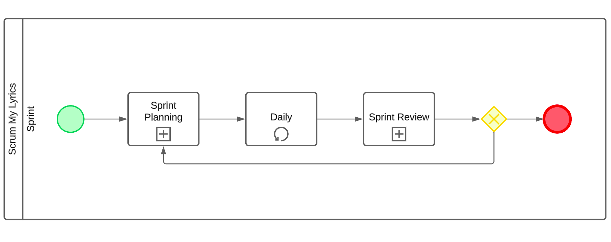
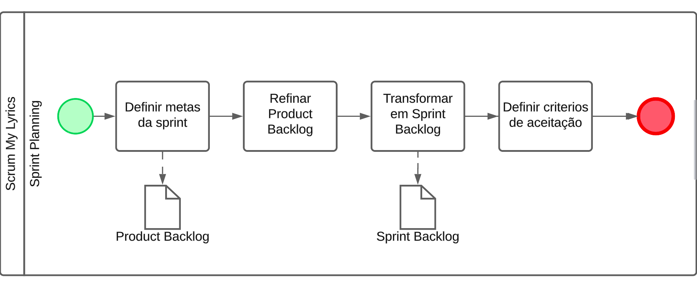
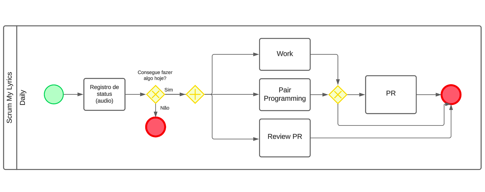
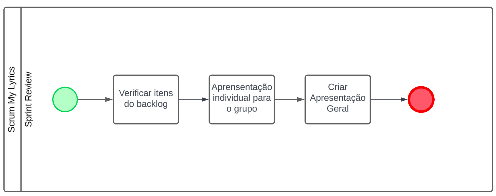

# 1.2. Módulo Processos/Metodologias/Abordagens

## Introdução

A integralização do módulo de Processos/Metodologias/Abordagens tem como objetivo a compreensão e aplicação de metodologias de desenvolvimento de software, bem como a modelagem de processos de negócio. A disciplina visa a compreensão de conceitos e práticas de metodologias ágeis, bem como a modelagem de processos de negócio utilizando a notação BPMN.

<!-- Foco_4: Metodologia (Modelagem BPMN & Escolhas Metodológicas)

Entrega Mínima: Modelagem BPMN, evidenciando algumas escolhas metodológicas utilizadas pela equipe nessa primeira entrega.

Apresentação (em sala) explicando o detalhamento metodológico desenhado, com: (i) rastro claro aos membros participantes (MOSTRAR QUADRO DE PARTICIPAÇÕES & COMMITS); (ii) justificativas & senso crítico sobre as escolhas metodológicas adotadas para o projeto; (iii) breve apresentação da modelagem em BPMN, e (iv) comentários gerais sobre o trabalho em equipe. Tempo da Apresentação: +/- 5min. Recomendação: Apresentar diretamente via Wiki ou GitPages do Projeto. Baixar os conteúdos com antecedência, evitando problemas de internet no momento de exposição nas Dinâmicas de Avaliação. -->

## Metodologias

Nosso grupo escolheu a metodologia ágil Scrum, porém modificada para nosso contexto.
As principais modificações feitas foram:
- Dailies assíncronas;
- Ausência de PO e Scrum Master;
- Remoção da cerimônia de retrospectiva da sprint.

# Diagrama BPMN

<figure align="center">

  
  <figcaption>Figura 1: Visão geral do BPMN</figcaption>
</figure>
<figure align="center">

  
  <figcaption>Figura 2: Detalhamento da Sprint Planning</figcaption>
</figure>
<figure align="center">

  
  <figcaption>Figura 3: Detalhamento da Daily</figcaption>
</figure>
<figure align="center">

  
  <figcaption>Figura 4: Detalhamento da Sprint Review</figcaption>
</figure>

### Conclusão

A modelagem de processos de negócio é uma atividade essencial para a compreensão e melhoria de processos organizacionais. A utilização da notação BPMN permite a representação de processos de negócio de forma clara e objetiva, facilitando a comunicação entre os envolvidos e a identificação de oportunidades de melhoria. A disciplina de Processos/Metodologias/Abordagens tem como objetivo a compreensão e aplicação de metodologias de desenvolvimento de software, bem como a modelagem de processos de negócio, contribuindo para o desenvolvimento de competências essenciais para a aplicação prática dos conceitos estudados. 

### Referências

- [BPMN 2.0](https://www.omg.org/spec/BPMN/2.0/)
- [Scrum Guide](https://www.scrumguides.org/docs/scrumguide/v2017/2017-Scrum-Guide-US.pdf)
- [Serrano, Milene](https://aprender3.unb.br/pluginfile.php/2790232/mod_label/intro/Arquitetura%20e%20Desenho%20de%20software%20-%20Aula%20BPMN%20Exemplos%20-%20Profa.%20Milene.pdf)