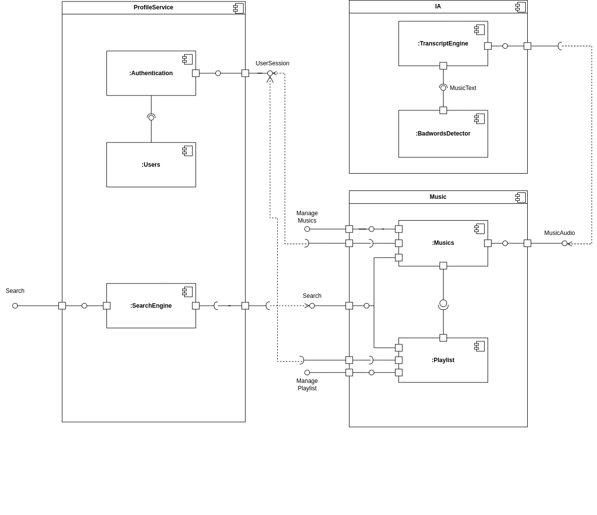

# 2.2.1. Notação UML – Diagramas Estáticos

### Foco_1: Modelagem UML Estática
Diagramação estática é uma técnica de engenharia de software que mostra a estrutura de um sistema. Esses diagramas exibem os componentes do sistema, seus atributos, métodos e como eles se relacionam. Sua principal função é oferecer uma visão clara e detalhada da arquitetura do sistema, o que facilita a compreensão, a comunicação entre equipes e a manutenção do software. É essencial na fase de design e documentação do sistema.

#### Diagrama de componentes
Para entendermos como os componentes principais da aplicação iriam se comunicar e
juntos formarem a solução do produto, foi elaborado um diagrama de componentes:

<figure align="center">

  
  <figcaption>Digrama de Componentes - My_Lyric</figcaption>
</figure>

#### Diagrama de classes

#### Diagrama de pacotes

#### Diagrama de implantação

