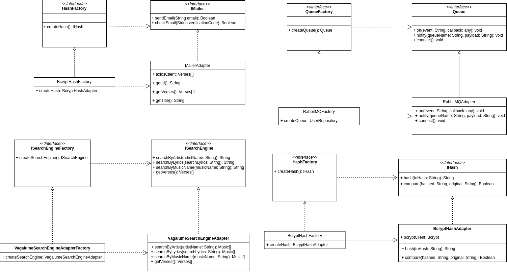
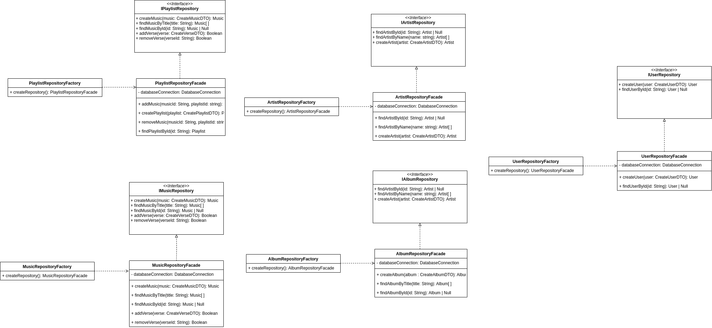
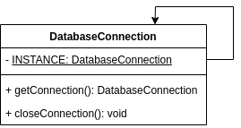

# 3.1. Módulo Padrões de Projeto GoFs Criacionais

## Factory

O padrão factory permite encapsular e padronizar a interface da criação objetos.
Com isso, é possível ter vários objetos diferentes, mas com mesma interface,
sendo criado de forma desacoplada. Além disso, como a criação do objeto foi
encapsulada, alterações nas dependências desses objetos não afetará toda a aplicação, mas somente a fábrica desse objeto.

No nosso projeto, criamos fábricas para todos os objetos que podem ser no futuro
substituídos por outros ou objetos que irão receber como parâmetro suas 
dependências. Dessa forma, a criação fica encapsulada e desacoplada, facilitando
refatorações futuras.

<!-- tabs:start -->

#### **Factories para os Adapters**
<figure align="center">

  
  <figcaption>Factories dos Adapters - Visão Geral</figcaption>
</figure>

#### **Factories para os Commands**
<figure align="center">

  
  <figcaption>Factories para os Commands</figcaption>
</figure>

#### **Factories para os Facades**
<figure align="center">

   
  <figcaption>Factories para os Facades</figcaption>
</figure>
<!-- tabs:end -->

## Singleton

O padrão singleton serve para criar instâncias únicas de um objeto, ele é
utilizado quando é necessário a reutilização e a proibição de criar múltiplos
objetos.

No nosso caso, a conexão com o banco de dados será crucial não ser duplicada.
Múltiplas conexões a um banco de dados causa lentidão ao servidor.

No futuro esse Singleton pode virar um Multiton ou Pool para ter múltiplas conexões de forma controlada.

<figure align="center">

   
  <figcaption>Singleton</figcaption>
</figure>

# Referências
- [Serrano, Milene](https://arquivos.unb.br/arquivos/20242520620d033079810403788c8e690/Arquitetura_e_Desenho_de_Software_-_Aula_GoFs_Criacionais_-_Profa._Milene.pdf)
- [Refactoring Guru](https://refactoring.guru/pt-br/design-patterns/creational-patterns)
- [Fireship](https://youtu.be/tv-_1er1mWI?si=9QQtWoqDZMSPgbMH)
- [Geekific, Singleton](https://www.youtube.com/watch?v=tSZn4wkBIu8&list=PLlsmxlJgn1HJpa28yHzkBmUY-Ty71ZUGc&index=2)
- [Geekific, Factory](https://www.youtube.com/watch?v=EdFq_JIThqM&list=PLlsmxlJgn1HJpa28yHzkBmUY-Ty71ZUGc&index=3)

# Histórico de versão

| Descrição                           | Autor                                              | Data       |
| ----------------------------------- | -------------------------------------------------- | ---------- |
| Adicionando histórico de versão     | Cauã                                               | 22/07/2024 |
| Adicionando Factories para Commands | Maria Luisa, Gustavo Henrique, Leonardo e Vinicius | 24/07/2024 |
| Adicionando Factories para Adapters | Cauã, Ian, Gustavo Kenzo e Samuel                  | 24/07/2024 |
| Adicionando Singleton               | Julio                                              | 24/07/2024 |
| Adicionando Factories para Facades  | Rafael, Bruno, Lucas e Manoel                      | 25/07/2024 |
| Adicionando referências             | Cauã                                               | 25/07/2024 |
| Adicionando explicações             | Cauã                                               | 25/07/2024 |
