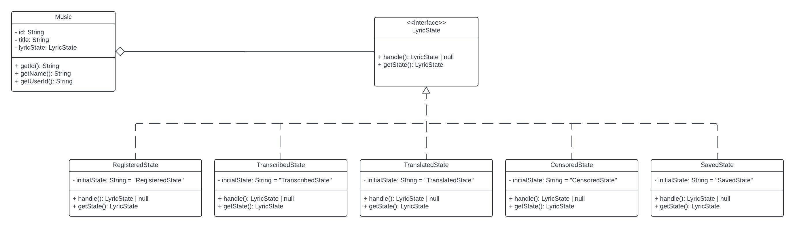
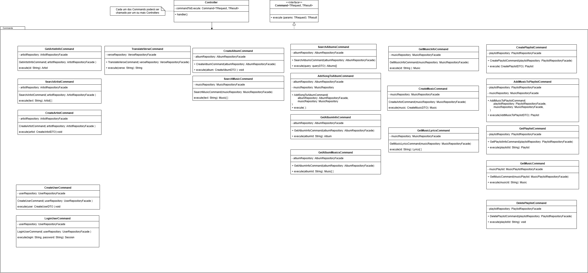

# 3.3. Módulo Padrões de Projeto GoFs Comportamentais
Os padrões comportamentais são um dos três tipos principais de padrões de design de software, ao lado dos padrões criacionais e estruturais. Eles se concentram em como as classes e objetos interagem e se comunicam, definindo algoritmos e fluxos de controle de forma dinâmica. Um exemplo é o padrão State, que permite que um objeto altere seu comportamento quando seu estado interno muda, tornando o objeto parecer que muda de classe. Outro exemplo é o padrão Command, que encapsula uma solicitação como um objeto, permitindo parametrizar clientes com filas, solicitações e operações. Esses padrões ajudam a tornar o sistema mais flexível, permitindo fácil extensão e manutenção.

## State Pattern
<figure align="center">

   
  <figcaption>Pattern State</figcaption>
</figure>

## Command Pattern
<figure align="center">

   
  <figcaption>Pattern Command</figcaption>
</figure>

# Histórico de versão

| Descrição | Autor | Data |
|----|----|----|
| Adicionando histórico de versão | Cauã | 22/07/2024 |
| Adicionando imagem do Pattern State | Cauã, Manoel, Samuel e Vinicius | 25/07/2024 |
| Adicionando imagem do Pattern Command | Leonardo, Lucas e Ian | 25/07/2024 |
| Adicionando descrição dos padrões comportamentais de design de software | Lucas, Leonardo e Ian |
